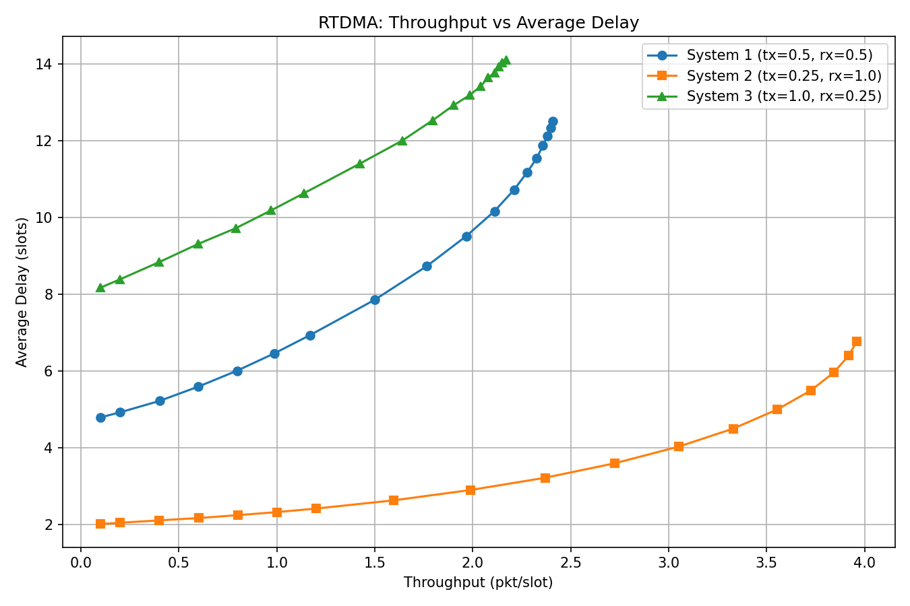
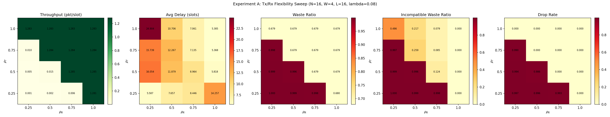
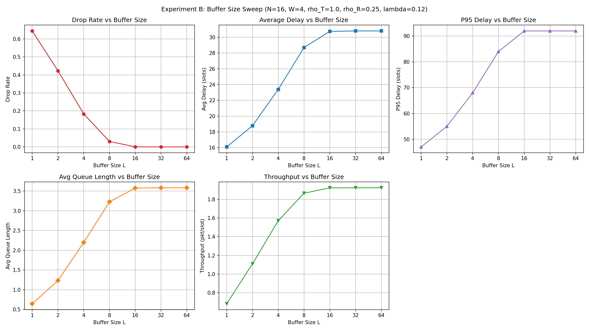
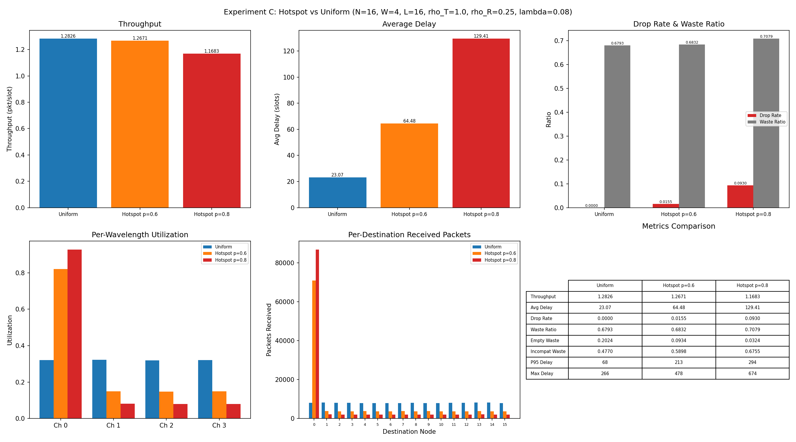

# RTDMA Protocol Simulator

A discrete-time simulation of the **Random TDMA (RTDMA)** protocol for synchronous packet-switched WDM passive-star networks, based on the analytical framework in:

> *Performance Analysis of Random TDMA and Slotted ALOHA in WDM Passive-Star Networks*

The simulator models $N$ nodes interconnected by $W$ wavelength channels through a passive star coupler, with finite per-node buffers, limited tuning ranges, and nonhomogeneous traffic.

## Project Structure

```
rtdma/
├── rtdma.py                  # Single simulation run (loads config.json)
├── sweep_systems.py           # Parametric sweep across hardware configurations
├── experiment_a_txrx.py       # Experiment A: Tx/Rx flexibility sweep
├── experiment_b_buffer.py     # Experiment B: Buffer size sweep
├── experiment_c_hotspot.py    # Experiment C: Hotspot vs uniform traffic
├── config.json                # Default configuration file
├── src/
│   ├── SimulatorConfig.py     # Configuration dataclass with validation
│   ├── Simulator.py           # Main simulation engine and metrics collection
│   ├── Scheduler.py           # RTDMA collision-free scheduler
│   ├── Node.py                # Node model with packet generation
│   └── Packet.py              # Packet and finite buffer with service policies
├── paper_summary.md           # Detailed summary of the paper's RTDMA analysis
└── RTDMA-ALOHA.pdf            # Original paper
```

## System Model

The network consists of $N$ nodes and $W$ wavelength channels. Each node $i$ is characterized by:

| Parameter | Description |
|-----------|-------------|
| $T_i \subseteq \{0, \dots, W{-}1\}$ | Wavelengths the transmitter can tune to |
| $R_i \subseteq \{0, \dots, W{-}1\}$ | Wavelengths the node can receive on |
| $L_i$ | Finite buffer capacity |
| $\lambda_i$ | Packet generation probability per slot |
| $d_{ij}$ | Probability a packet from node $i$ is destined to node $j$ |

From the node-level sets, the simulator derives channel-level sets:

$$A_k = \{i : k \in T_i\}, \qquad B_k = \{i : k \in R_i\}$$

where $A_k$ is the set of nodes that can transmit on wavelength $k$, and $B_k$ is the set of nodes that can receive on wavelength $k$.

For single-hop communication, every source-destination pair must have at least one common wavelength:

$$T_i \cap R_j \neq \emptyset, \qquad \forall\, i \neq j$$

The simulator validates this constraint at initialization.

## RTDMA Scheduling Algorithm

Each time slot, the scheduler produces a collision-free assignment $\text{trans}[i] = k$, meaning node $i$ is allowed to transmit on wavelength $k$. The algorithm enforces three invariants:

- Each wavelength is assigned to **at most one** transmitting node
- Each node is assigned **at most one** wavelength
- A node is only assigned a wavelength in its tuning range: $\text{trans}[i] = k \implies i \in A_k$

The schedule is constructed as follows:

1. Initialize all wavelengths as available: $\Omega = \{0, \dots, W{-}1\}$
2. Copy each channel candidate set: $\hat{A}_k = A_k$
3. Randomly choose a channel $k$ from $\Omega$
4. Randomly choose a node $i$ from $\hat{A}_k$
5. Set $\text{trans}[i] = k$
6. Remove node $i$ from all remaining candidate sets $\hat{A}_j$
7. Remove $k$ from $\Omega$ and repeat until $\Omega$ is empty

The scheduler does **not** inspect buffer contents. It only grants transmission opportunities. If the scheduled node has no compatible queued packet, the opportunity is wasted (but no collision occurs).

## Simulation Loop

Time is slotted: $t = 0, 1, \dots, T{-}1$. Each slot executes:

$$\text{arrivals} \;\rightarrow\; \text{RTDMA scheduling} \;\rightarrow\; \text{transmissions} \;\rightarrow\; \text{metrics update}$$

**Arrivals.** Each node independently generates a packet with probability $\lambda_i$:

$$A_i(t) \sim \text{Bernoulli}(\lambda_i)$$

If generated, the packet destination is sampled according to the configured `destination_policy`:

- **`uniform`**: destination chosen uniformly from all other nodes, $d_{ij} = \frac{1}{N-1}$
- **`hotspot`**: with probability $p$ the packet targets a designated hotspot node $h$; otherwise the destination is uniform over the remaining $N-2$ nodes. Packets originating at the hotspot itself use uniform selection over all $N-1$ others.

The packet is added to node $i$'s buffer, or dropped if the buffer is full.

**Scheduling.** The RTDMA scheduler assigns one node per wavelength as described above.

**Transmission.** For a node $i$ scheduled on wavelength $k$, transmission succeeds only if the buffer contains at least one packet whose destination is in $B_k$:

$$\exists\, p \in Q_i(t) \;\text{ such that }\; p.\text{destination} \in B_k$$

Which packet is selected depends on the buffer service policy.

## Buffer Service Policies

The buffer supports three packet selection policies, configurable per node:

| Policy | Behavior |
|--------|----------|
| `fifo` | Transmits the head-of-line packet only if its destination is in $B_k$. Can suffer head-of-line blocking. |
| `fifo-compatible` | Scans from oldest to newest packet and transmits the first one whose destination is in $B_k$. Avoids HoL blocking while preserving age priority. This is the paper-faithful default. |
| `uniform-random` | Selects uniformly at random among all buffered packets with a destination in $B_k$. |

The `fifo-compatible` policy is the natural match for RTDMA, because the assigned wavelength varies each slot and restricts which destinations are reachable. Strict FIFO can waste scheduled opportunities when the oldest packet happens to target a node outside $B_k$, even if later packets could be served.

## Configuration

Simulations are driven by a `SimulatorConfig` dataclass. Parameters that accept either a scalar (applied uniformly) or a per-node list:

```json
{
    "num_time_slots": 1000000,
    "num_nodes": 8,
    "num_wavelengths": 4,
    "buffer_sizes": 4,
    "buffer_policies": "fifo-compatible",
    "arrival_probabilities": 0.3,
    "tx_channel_ratios": 0.5,
    "rx_channel_ratios": 0.5,
    "tx_assignment_policy": "round-robin",
    "rx_assignment_policy": "round-robin",
    "destination_policy": "uniform",
    "seed": 42
}
```

### Channel Assignment Policies

The number of channels assigned to node $i$ is derived from its ratio:

$$|T_i| = \max\!\Big(1,\; \big\lceil \rho_i^{\,T} \cdot W \big\rceil\Big), \qquad |R_i| = \max\!\Big(1,\; \big\lceil \rho_i^{\,R} \cdot W \big\rceil\Big)$$

The specific channels are then chosen by:

| Policy | Description |
|--------|-------------|
| `all` | Every node gets all $W$ channels |
| `round-robin` | Channels are assigned in a deterministic round-robin rotation |
| `random` | Channels are sampled uniformly at random |

After assignment, the simulator validates full connectivity ($T_i \cap R_j \neq \emptyset$ for all $i \neq j$) and retries if necessary.

## Metrics

The simulator records raw counters and derives the following performance metrics:

$$\text{Throughput} = \frac{\text{packets transmitted}}{T}$$

$$\text{Drop rate} = \frac{\text{packets dropped}}{\text{packets generated}}$$

$$\text{Average delay} = \frac{\displaystyle\sum_{\text{transmitted packets}} \!\text{delay}_p}{\text{packets transmitted}}$$

$$\text{Waste ratio} = \frac{\text{wasted scheduled opportunities}}{\text{total scheduled opportunities}}$$

$$\text{Channel utilization} = \frac{\text{packets transmitted}}{W \cdot T}$$

The **waste ratio** is the key RTDMA-specific metric. Because RTDMA eliminates collisions, the only source of inefficiency is scheduling a node on a wavelength for which it has no compatible buffered packet. Waste is further decomposed into two components:

$$\text{Waste ratio} = \text{Empty waste ratio} + \text{Incompatible waste ratio}$$

- **Empty waste**: the node's buffer is entirely empty when scheduled
- **Incompatible waste**: the buffer has packets, but none target a destination reachable on the assigned wavelength

Per-node throughput, per-wavelength utilization, per-destination received packet counts, queue length snapshots, and delay percentiles (p50, p95, p99) are also tracked.

## Running the Simulator

**Single run** with `config.json`:

```bash
python rtdma.py
```

This loads `config.json`, runs the simulation, and prints global metrics, delay statistics, per-node throughput, per-wavelength utilization, and average queue lengths.

**Inline configuration** (edit `rtdma.py`):

```python
config = SimulatorConfig(
    num_time_slots=1_000_000,
    num_nodes=8,
    num_wavelengths=4,
    buffer_sizes=4,
    buffer_policies="fifo-compatible",
    arrival_probabilities=0.3,
    tx_channel_ratios=1.0,
    rx_channel_ratios=1.0,
    tx_assignment_policy="all",
    rx_assignment_policy="all",
    destination_policy="uniform",
    seed=42,
)
```

**Parametric sweep** across hardware configurations:

```bash
python sweep_systems.py
```

This runs 54 simulations (3 systems $\times$ 18 arrival probabilities) at 1,000,000 slots each and produces `sweep_results.png`.

## Results: Throughput vs. Delay

`sweep_systems.py` reproduces Figure 5 of the paper, comparing three hardware configurations for an $N=8$, $W=4$ system with buffer size $L=4$ and uniform traffic:

| System | Tx coverage | Rx coverage | Description |
|--------|------------|------------|-------------|
| System 1 | $\|T_i\|/W = 0.5$ | $\|R_i\|/W = 0.5$ | Balanced: each node tunes to 2 of 4 channels and listens on 2 of 4 |
| System 2 | $\|T_i\|/W = 0.25$ | $\|R_i\|/W = 1.0$ | Narrow Tx, full Rx: each transmitter is fixed to 1 channel, all receivers hear everything |
| System 3 | $\|T_i\|/W = 1.0$ | $\|R_i\|/W = 0.25$ | Full Tx, narrow Rx: every transmitter can tune to all channels, each receiver is fixed to 1 |



The results confirm the paper's findings:

- **System 2 (narrow Tx, full Rx) achieves the best performance.** It reaches the highest throughput (~4.0 pkt/slot) with the lowest delay across all load levels. Because every node can receive on all wavelengths, any scheduled transmission is guaranteed to reach its destination's receiver. The narrow transmitter tuning (1 channel per node) means only 2 nodes compete per channel, reducing scheduling contention. The waste ratio stays low because $B_k$ covers all nodes for every $k$.

- **System 1 (balanced) is intermediate.** With 2 Tx and 2 Rx channels per node, it saturates at about 2.5 pkt/slot. The partial Rx coverage means some scheduled opportunities are wasted when the assigned channel's receiver set $B_k$ does not include any of the node's buffered packet destinations.

- **System 3 (full Tx, narrow Rx) performs worst.** Despite full transmitter tunability, each node listens on only 1 channel, so $|B_k| = 2$. When node $i$ is scheduled on channel $k$, the probability that at least one of its $j$ buffered packets targets a node in $B_k$ is $1 - (1 - \Delta_k^{(i)})^j$, where $\Delta_k^{(i)} = \sum_{m \in B_k} d_{im}$. With only 2 receivers per channel and uniform traffic, $\Delta_k^{(i)} \approx 2/7 \approx 0.29$, leading to frequent wasted slots. Additionally, all 8 nodes compete for every channel, increasing scheduling delay. The result is both higher delay and lower maximum throughput.

The core insight is that **receiver diversity matters more than transmitter tunability** for RTDMA performance. Broader receiver coverage increases the set of destinations reachable through each scheduled wavelength, directly reducing the waste ratio and improving both throughput and delay.

## Experiment Scripts

Three experiment scripts evaluate specific RTDMA weaknesses. Each produces a multi-panel PNG figure.

### Experiment A: Tx/Rx Flexibility Sweep (`experiment_a_txrx.py`)

Investigates how limited wavelength compatibility (transmitter and receiver tuning range) affects performance. Sweeps $\rho_T \times \rho_R \in \{0.25, 0.5, 0.75, 1.0\}^2$ (16 combinations) with $N=16$, $W=4$, $L=16$, $\lambda=0.08$, uniform traffic, and random channel assignment.

```bash
python experiment_a_txrx.py
```

Outputs 5 heatmaps (`experiment_a_results.png`): throughput, average delay, waste ratio, incompatible waste ratio, and drop rate. Uses `require_full_connectivity=False` since low $\rho$ combinations cannot guarantee reachability between all node pairs.



### Experiment B: Buffer Size Sweep (`experiment_b_buffer.py`)

Studies the impact of finite queueing capacity on loss and delay. Sweeps $L \in \{1, 2, 4, 8, 16, 32, 64\}$ with $N=16$, $W=4$, $\rho_T=1.0$, $\rho_R=0.25$, $\lambda=0.12$, uniform traffic, and round-robin assignment.

```bash
python experiment_b_buffer.py
```

Outputs line plots on a log-2 x-axis (`experiment_b_results.png`): drop rate, average delay, P95 delay, average queue length, and throughput.



### Experiment C: Hotspot Traffic (`experiment_c_hotspot.py`)

Compares uniform destination traffic against non-uniform (hotspot) traffic where one node attracts a disproportionate share of packets. Runs three scenarios: uniform, hotspot $p=0.6$, and hotspot $p=0.8$, with $N=16$, $W=4$, $L=16$, $\rho_T=1.0$, $\rho_R=0.25$, $\lambda=0.08$, and round-robin assignment.

```bash
python experiment_c_hotspot.py
```

Outputs a 6-panel figure (`experiment_c_results.png`): throughput, average delay, drop rate + waste ratio, per-wavelength utilization, per-destination received packets, and a scalar metrics comparison table.



## Dependencies

- Python 3.10+
- `matplotlib` (for plotting scripts)
- `numpy` (for experiment scripts)

The simulation engine itself uses only the standard library.
